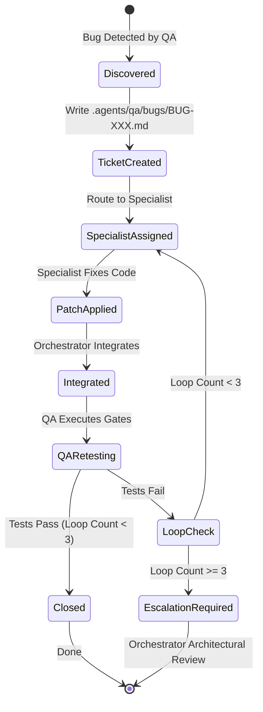

# Multi-Agent Development System Workflow

## 1. Overview & Architecture

The **Local TTS Studio** repository utilizes an enterprise multi-agent workflow where roles, boundaries, and responsibilities are strictly separated. Single agents must not span full-stack development end-to-end without modular handoffs and independent QA validation.

```text
               MAIN AGENT / ORCHESTRATOR
                         │
        ┌────────────────┴────────────────┐
        ▼                                 ▼
BACKEND SPECIALIST              FRONTEND UX/UI SPECIALIST
(src/main/**, src/preload/**,    (src/renderer/**, components,
 src/shared/**, db/ffmpeg/tts)    pages, stores, styles, i18n)
        │                                 │
        └────────────────┬────────────────┘
                         ▼
                  INTEGRATED BUILD
                         │
                         ▼
               QA & TEST AUTOMATION
               (tests/**, QA gates,
                .agents/qa/bugs/BUG-XXX.md)
                         │
                   PASS / FAIL
                         │
             ┌───────────┴───────────┐
             │                       │
           PASS                     FAIL
             │                       │
      SHIP / MERGE                   ▼
                         SELF-HEALING ROUTING
                         (Target Specialist / Max 3 Loops)
```

---

## 2. Canonical File Ownership Matrix

To prevent conflicts and regressions, subagents have strict file ownership boundaries:

| Role | Allowed Write Paths | Prohibited Write Paths | Primary Focus |
| :--- | :--- | :--- | :--- |
| **Main Orchestrator** | Root coordination, `.agents/WORKFLOW.md`, integration checkpoints, Task Contracts | Direct feature hacking without subagent delegation | System architecture, contract definition, task routing, integration review |
| **`backend-specialist`** | `src/main/**`<br>`src/preload/**`<br>`src/shared/**`<br>`tests/**` (backend test files) | `src/renderer/**` | IPC handlers, SQLite migrations, TTS adapters (Edge, LucyLab, ElevenLabs, Vbee), Segment Engine, Audio Queue, FFmpeg pipeline, File I/O security |
| **`frontend-ux-ui-specialist`** | `src/renderer/**` (components, pages, stores, hooks, styles, i18n, assets) | `src/main/**`<br>`src/preload/**`<br>`src/shared/**` | UI components, Tailwind styling, Zustand/Pinia stores, Waveform visualizer, Subtitle timeline, settings UI, accessibility |
| **`qa-test-automation-specialist`** | `tests/**`<br>`.agents/qa/bugs/**`<br>`tmp_test_*` | `src/main/**`<br>`src/preload/**`<br>`src/renderer/**` | Independent test execution (`typecheck`, `lint`, `test`, `build`), edge-case stress tests, regression suites, bug ticketing |

---

## 3. Task Contract Specification

Before invoking specialist subagents, the Orchestrator freezes the interface contract:

```markdown
# TASK CONTRACT: [Feature / Fix Title]
- Contract ID: TC-[YYYYMMDD]-[FeatureName]
- Scope: [Detailed scope description]
- Frozen Interfaces & IPC:
  - Channel: [e.g. tts:cancel-item]
  - Request Payload Schema: [JSON / TypeScript interface]
  - Response Schema: [JSON / TypeScript interface]
  - Events: [e.g. queue:item-progress]
- File Allocations:
  - Backend Specialist: [Explicit list of files]
  - Frontend Specialist: [Explicit list of files]
- Acceptance Criteria:
  1. [Criterion 1]
  2. [Criterion 2]
- Definition of Done:
  - [ ] TypeScript typecheck clean (0 errors)
  - [ ] ESLint clean (0 errors)
  - [ ] All unit and integration tests passing (100%)
  - [ ] Production build succeeds
```

---

## 4. Machine-Actionable Handoff Protocol

Each specialist finishes their work and submits a structured handoff block to the Orchestrator.

### Backend Specialist Handoff Format:
```text
STATUS: READY_FOR_INTEGRATION / BLOCKED
FILES_TOUCHED:
  - src/...
NEW_APIS_OR_IPC:
  - channel_name: input -> output
CONTRACT_COMPLIANCE: FULL / PARTIAL
TESTS_ADDED_OR_UPDATED:
  - tests/...
NOTES_FOR_FRONTEND:
  - [e.g., exposed window.electronAPI.method]
KNOWN_LIMITATIONS:
  - [Any caveats or mock dependencies]
```

### Frontend Specialist Handoff Format:
```text
STATUS: READY_FOR_INTEGRATION / BLOCKED
COMPONENTS_TOUCHED:
  - src/renderer/...
STORE_CHANGES:
  - src/renderer/store/...
IPC_CONSUMED:
  - window.electronAPI.xyz
ACCESSIBILITY_AND_I18N:
  - Checked Vietnamese labels, truncation, ARIA attributes
TEST_IDS_ADDED:
  - [e.g., data-testid="segment-item-0"]
NOTES_FOR_QA:
  - [Instructions for UI interactions or edge cases]
```

---

## 5. QA Protocol & Independent Validation

QA runs independently after Orchestrator merges Backend and Frontend branches. QA **never** assumes specialist reports are accurate without automated verification.

### Mandatory QA Gates:
1. `npm run typecheck` — 0 errors across Node and Web tsconfigs.
2. `npm run lint` — 0 ESLint errors/warnings.
3. `npm test` — 100% test pass rate with zero flaky failures.
4. `npm run build` — Clean production compilation via Vite / electron-builder.
5. Functional & Regression test suites in `tests/`.

### Bug Ticket Specification (`.agents/qa/bugs/BUG-XXX.md`):
When any failure or discrepancy occurs, QA files a ticket:

```markdown
# BUG-XXX: [Concise Title]
- Status: OPEN / RESOLVED / CLOSED / ESCALATED
- Severity: CRITICAL / HIGH / MEDIUM / LOW
- Assigned Specialist: `backend-specialist` | `frontend-ux-ui-specialist` | `ORCHESTRATOR`
- Reproduction Steps:
  1. ...
  2. ...
- Expected Result: ...
- Actual Result: ...
- Error Log / Stack Trace:
  ```text
  ...
  ```
- Regression Risk: ...
- Fix Verification Requirement: ...
```

---

## 6. Self-Healing Loop & Circuit Breaker



- **Max Fix Attempts**: 3 iterations for any single bug ticket.
- **Circuit Breaker**: If 3 attempts fail to pass QA gates, the bug is marked `ESCALATION_REQUIRED`. Orchestrator halts automated loops, performs root-cause architectural analysis, and resets the contract.

---

## 7. Documentation Sync Rule (Source of Truth Maintenance)

To prevent documentation drift, the codebase enforces an automated documentation sync gate immediately following successful QA validation.

### Canonical Workflow:
```text
Feature Request / Bug
         │
         ▼
Backend Specialist + Frontend Specialist
         │
         ▼
Integrated Build
         │
         ▼
QA Independent Validation
         │
         ▼
   QA STATUS = PASS
         │
         ▼
DOCUMENTATION SYNC GATE (Mandatory)
         │
         ▼
    Git Commit
```

> [!CAUTION]
> **No Documentation Drift Policy**: Under NO circumstances should a git commit be made with `QA STATUS = PASS` without executing the Documentation Sync Gate. If code changes, documentation MUST change in the same atomic commit.

### Orchestrator Determination Checklist:
After every `QA STATUS = PASS`, the Orchestrator must evaluate:
- [ ] **Did architecture change?** (Services, pipelines, queue, audio, process model)
- [ ] **Did feature status change?** (`DONE`, `PARTIAL`, `PLACEHOLDER`, `TODO`, `BROKEN`)
- [ ] **Did database change?** (Migrations, tables, indexes, schema version)
- [ ] **Did IPC change?** (Channels, payloads, preload methods, event broadcasts)
- [ ] **Did UI change?** (Screens, routes, components, design tokens, UX states)
- [ ] **Did agent/skill configuration change?** (Roster, tools, installed skills)
- [ ] **Did tests change?** (Test counts, test files, coverage additions)

If **YES** to any question: Update the relevant documents immediately before committing.

### Document Update Ownership Matrix:

| Document | Primary Owner | Reviewer / Sign-off | Scope |
| :--- | :--- | :--- | :--- |
| `docs/PROJECT_STATE.md` | **Main Orchestrator** | All Specialists | High-level status, tech stack, inventory, gates, risks |
| `docs/ARCHITECTURE.md` | **Backend Specialist** | Main Orchestrator | Deep technical architecture, DB, IPC, pipelines, security |
| `docs/FEATURE_MATRIX.md` | **QA Specialist** | Main Orchestrator | Granular scan of all feature statuses (DONE/PARTIAL/etc.) |
| `docs/UI_SYSTEM.md` | **Frontend UX/UI Specialist** | QA Specialist | UI routes, screens, component catalog, design tokens, states |

### Documentation Pre-Commit Checklist:
Before declaring any task or contract complete, verify:
- [ ] `docs/PROJECT_STATE.md` reflects current Git commit, test count, and status.
- [ ] `docs/FEATURE_MATRIX.md` statuses are verified against working code.
- [ ] `docs/ARCHITECTURE.md` is updated if services, DB, or IPC were modified.
- [ ] `docs/UI_SYSTEM.md` is updated if UI components or routes were modified.
- [ ] Actual Git commit hash is recorded (`git rev-parse --short HEAD`).
- [ ] Automated test counts match real runner output (`npm test`).
- [ ] Known issues and technical debt are documented truthfully.
